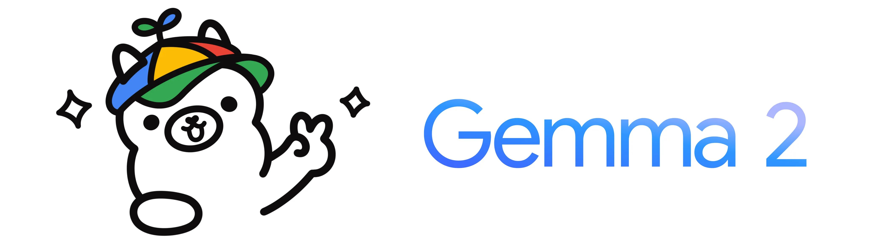

<!--
# Potential Talents: Retrieval for Candidate Job Titles (NLP)

---
-->
</td>
    <td style="text-align: center;">
      
    </td>


### Industry: 
Human Resources - Talent sourcing

### Context: 
In the talent sourcing industry, connecting the right candidate to the right opportunity is a complex challenge. Recruiters must not only understand a client’s technical requirements but also recognize what makes a candidate truly stand out for a given role. Traditional keyword-based search often fails to capture the nuances of job titles, skills, and role similarities,  especially in the fast-evolving technology sector.

This project was developed as part of **Apziva**, focusing on building data-driven solutions through machine learning and large language models.

### Objective:
Build a robust, intelligent retrieval system capable of identifying and ranking semantically similar job titles and candidate profiles. 
Exploring different approaches, from most elementary like using TF-IDF to more evolved using SBERT, LLM Fine Tuning, RAG with FAISS indexing and consulting big LLM through API.

### What we include in this project? 
This work involved a lot of different techniques in NLP, from simpler approaches to more evolved. Applying different combination of techniques, metrics, solution design and two final efficient approaches prepared for implementation: 
  - a Fine Tuned LLM based on LLaMA 3.2 3B (covered in the project part 5)
  - a RAG (indexed using FAISS) + a big LLM using API (covered in the project part 6)

---

### Project Highlights  

- **Full retrieval ladder:** `TF-IDF → Word2Vec (SGNS) → SBERT + FAISS → LLM re-ranking`  
- **Custom mini-Word2Vec** embedding trained from scratch on domain text  
- **Local LLM inference** on GPU: Phi-3-mini (Microsoft), Gemma2 (Google), Qwen2.5 (Qwen), LLaMA3 (Meta)
  
     
  
- **External API LLMs:** Kimi K2 (Moonshot AI), deepseek-chat (deepseek), Grok 4 (xAI), gpt-4o (OpenAI)
  
     
- **Instruction Fine-Tuned LLaMA 3.2 3B** for candidate scoring  
- **RAG with FAISS (IVF index)** centroid-based ANN tuned (`nlist`, `nprobe`) for **high recall** and **3–8× speedup** over exact search  
- **Comprehensive evaluation:** Recall@k, nDCG@k, and latency, plus qualitative checks on Data Science, ML Engineering, Backend, and PM queries  


---

## RAG Solution Architecture (Part 6)

```
Query
│
├─► SBERT encoder (all-mpnet-base-v2) → L2-normalized vectors
│
├─► FAISS IVF (centroid-based ANN)
│ • nlist=32, nprobe=16 (balanced recall/speed)
│ • retrieve top-N candidate titles
│
├─► Prompt composer (compact context)
│ • formats top-N with [index], score, title
│
└─► LLM re-ranker (OpenAI, API accessed)
```

**Performance snapshot**

- **Retrieval latency:** ~**0.2–0.3 ms/query** (IVF, cosine via inner product on normalized vectors)  
- **Bottleneck:** LLM inference time (seconds), not vector search

---

## Repository Structure

### Notebooks

- **[Part 1 - EDA + TF-IDF + Cosine Search](./Potential_Talents_part1.ipynb)**  
  Explores and cleans the dataset, builds a manual and scikit-learn TF-IDF representation, and validates cosine similarity for job-title retrieval. 
- **[Part 2 - Word2Vec Embeddings](./Potential_Talents_part2.ipynb)**  
  Trains a custom skip-gram model on job titles, visualizes the learned vector space, and compares semantic proximity between technical roles. 
- **[Part 3 - Sentence Transformers (SBERT)](./Potential_Talents_part3.ipynb)**  
  Encodes job titles using all-mpnet-base-v2 and performs semantic search with cosine similarity, showing major accuracy gains over classical embeddings.
- **[Part 4 - Large-Scale Evaluation and Ranking](./Potential_Talents_part4.ipynb)**  
  Benchmarks SBERT retrieval using Recall@k and nDCG@k. Prepares labeled datasets for supervised fine-tuning.
- **[Part 5 - Instruction Fine-Tuning LLaMA 3.2](./Potential_Talents_part5.ipynb)**    
  Generates chat-formatted JSONL (train/val/test) pairs with numeric similarity labels, preparing data for model fine-tuning.
- **[Part 5t - LoRA Fine-Tuning (training)](./Potential_Talents_part5t.ipynb)**    
   Fine-tunes meta-llama/Llama-3.2-3B-Instruct using LoRA adapters to predict similarity scores (0–100) for query-title pairs on a single GPU.
- **[Part 6 - RAG + FAISS Retrieval](./Potential_Talents_part6.ipynb)**    
  Implements a centroid-based FAISS index (IVF) for fast ANN search, integrates an API-based LLM for re-ranking, and evaluates recall, nDCG, and latency.


### Folder Structure:

```
Potential_Talents/
│   .env                                 # API urls and keys
│   .gitignore
│   README.md
│   tools_llm_ift.py                     # Toolkit for scoring, fine-tuning data prep, and LLM ranking
│   pairwise_llm_dataset_ready.csv       # Final labeled dataset (query-title pairs + scores)
│   pairwise_llm_dataset_ready_bkp.csv   # Backup of final dataset
│   pairwise_llm_dataset_skeleton.csv    # Base skeleton before scoring
│
│   Potential_Talents_part1.ipynb        # EDA, TF-IDF, and cosine search baseline
│   Potential_Talents_part2.ipynb        # Word2Vec embeddings and semantic similarity
│   Potential_Talents_part3.ipynb        # SBERT embeddings and semantic retrieval
│   Potential_Talents_part4.ipynb        # Evaluation and dataset preparation
│   Potential_Talents_part5.ipynb        # Instruction dataset generation (JSONL)
│   Potential_Talents_part5t.ipynb       # LoRA fine-tuning for LLaMA 3.2 3B
│   Potential_Talents_part6.ipynb        # RAG + FAISS + API LLM re-ranking
│
├── data/
│   ├── potential_talents.csv            # Original dataset of job titles
│   ├── text8 / text8.zip                # Corpus used for mini Word2Vec training
│   └── test_Official_word2vec.ipynb     # Validation notebook for Word2Vec embedding
│
├── ft_data/
│   ├── llama_pairwise_train.jsonl       # Fine-tuning training split
│   ├── llama_pairwise_val.jsonl         # Fine-tuning validation split
│   └── llama_pairwise_test.jsonl        # Fine-tuning test split
│
├── outputs/
│   ├── sbert_ranking_output.csv         # SBERT semantic ranking results
│   │
│   ├── llm/                             # LLM re-ranking results from different APIs
│   │   ├── llm_top10__llama-3.2-3b-instruct-pairwise__all_queries.csv
│   │   ├── llm_top10__gpt-4o__pairwise__all_queries.csv
│   │   ├── llm_top10__gemma-2-2b-it__listwise__all_queries.csv
│   │   ├── llm_top10__phi3_mini_4k__listwise__all_queries.csv
│   │   ├── llm_top10__qwen2.5-3b-instruct__listwise__all_queries.csv
│   │   ├── llm_top10__deepseek-chat__pairwise__all_queries.csv
│   │   ├── llm_top10__grok-4-fast__pairwise__all_queries.csv
│   │   └── llm_top10__kimi-k2-0905-preview__listwise__all_queries.csv
│   │
│   └── rag_index/                       # RAG FAISS index data
│       ├── embeddings.npy
│       ├── flatip.index                 # Exact search (IndexFlatIP)
│       ├── ivf_nlist32.index            # Centroid-based ANN index (IVF)
│       └── titles.parquet               # Serialized job titles
│
└── sup_imgs/                            # Supplementary images for documentation or reports

```

---

### Business Impact

- **Recruiting efficiency:** the retrieval system shortens candidate discovery cycles by finding the most relevant profiles in seconds, reducing manual screening time and human bias.  
- **Semantic precision:** by combining **SBERT embeddings**, a **Fine-Tuned LLaMA 3.2-3B**, and **RAG with FAISS**, the model understands contextual nuances between job titles (e.g., *“ML Engineer” ↔ “Data Scientist”*) rather than relying on keyword overlap.  
- **Scalability:** the FAISS-based retrieval architecture enables **vectorized, GPU-accelerated search**, supporting thousands of candidates while maintaining millisecond latency.  
- **Business value:** HR and staffing teams can prioritize the best-fit candidates faster, improving talent placement quality and decreasing time-to-hire.

---

### This Project Showcases

- **AI pipeline** for information retrieval, from classical TF-IDF to semantic search, LLM fine-tuning, and Retrieval-Augmented Generation (RAG).  
- **Hands-on expertise** with Python, Transformers, FAISS, and LoRA fine-tuning on limited hardware (GTX 1080 Ti).  
- **Applied research mindset:** translating modern NLP techniques into practical HR applications that bridge **AI** and **business impact**.  

---

## Interested in Implementing This?

If you’d like to explore how semantic retrieval and LLMs can enhance your recruiting or internal mobility workflows, feel free to connect:

🔗 [LinkedIn Profile](https://www.linkedin.com/in/federicobessi/)  
📫 **federico.bessi@gmail.com**

